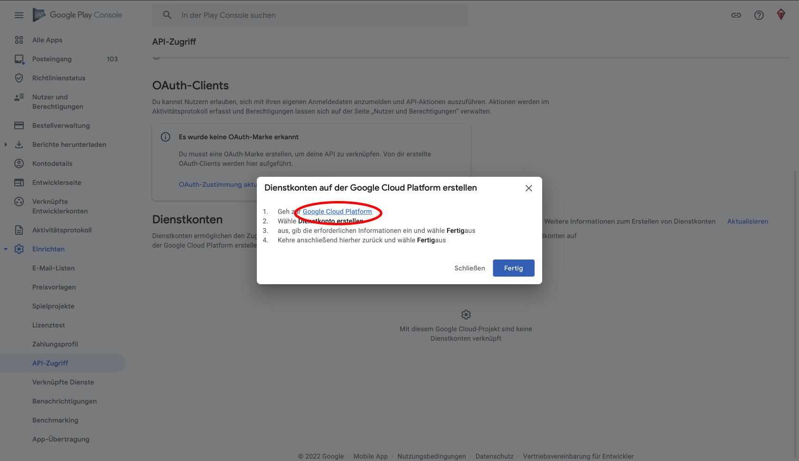

# Creating Google Service Account

Wenn Sie Ihre Android-App im Google Play Store mit `eas submit` einreichen möchten, müssen Sie einen Schlüssel für ein Google-Servicekonto erstellen. Diese Seite wird Sie durch diesen Prozess führen.

1. Öffnen Sie [Google Play Console](https://play.google.com/apps/publish/), Erweitern Sie **Einrichten**, und wählen Sie **API-Zugriff**.

2. Wenn Sie die Meldung erhalten, dass der API-Zugriff für Ihr Konto nicht aktiviert ist, müssen Sie zunächst Ihr Google Play-Entwicklerkonto mit einem Google Developer Project verknüpfen. Wählen Sie auf dieser Seite **Wählen Sie ein zu verknüpfendes Projekt** und verknüpfen Sie es dann entweder mit einem bestehenden Projekt, wenn Sie eines haben, oder wählen Sie **Neues Projekt erstellen** und klicken Sie dann auf **Projekt verknüpfen**.

3. Klicken Sie auf **Weitere Informationen zum Erstellen von Dienstkonten** und folgen Sie dem Link **Google Cloud Platform** im Dialogfeld.

4. Klicken Sie auf eine weitere Schaltfläche **DIENSTKONTO ERSTELLEN**.

5. Geben Sie den Namen dieses Dienstkontos in das Feld "Name des Dienstkontos" ein. Wir empfehlen einen Namen, der es Ihnen leicht macht, sich zu merken, dass es sich um Ihr Google Play Console-Konto handelt. Geben Sie außerdem die ID des Dienstkontos und eine Beschreibung Ihrer Wahl ein. Klicken Sie auf die Schaltfläche **Erstellen und Fortfahren**.

6. Klicken Sie auf **Wählen Sie eine Rolle** und wählen Sie **Dienstkonten > Dienstkontonutzer**. Klicken Sie auf **FERTIG**.

7. Wählen Sie **Schlüssel verwalten** aus der Optionsschaltfläche für Ihr neu erstelltes Dienstkonto und dann **Neuen Schlüssel erstellen**. Wählen Sie **JSON** und dann die Schaltfläche **ERSTELLEN**. Laden Sie die `json`-Datei herunter und speichern Sie sie an einem sicheren Ort.

8. Kehren Sie zur **API-Zugangsseite** in der Google Play Console zurück und vergewissern Sie sich, dass Ihr neues Dienstkonto dort angezeigt wird. Klicken Sie auf **Play Console-Berechtigungen verwalten** für das neu hinzugefügte Dienstkonto.

9. Klicken Sie auf **Nutzer einladen**.

10. Klicken Sie auf **Einladung senden**,

11. Das war's schon! Von nun an können Sie das generierte Google Service-Konto verwenden, um Ihre App mit `eas submit` hochzuladen.
